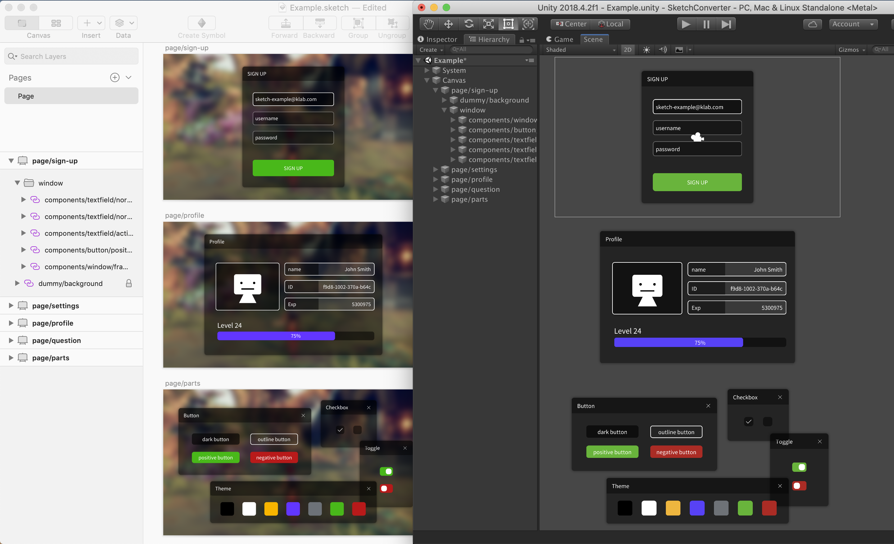

# SketchConverter
SketchConverterは、Sketchファイルから GameObject を生成するツールです。



- Sketch ファイルの階層を元に uGUI のコンポーネントがアタッチされた GameObject を生成します。
- Sketch ファイルのアンカー設定を RectTransform で再現します。
- Sketch ファイルは Unity プロジェクトの管理下におく必要はありません。
- 次の内容を拡張可能です
  - 階層構造の生成処理
  - 各レイヤー毎の変換処理
  - Sketch ファイルのロード、解析処理

## Convertible
拡張を行わない場合、 Sketch ファイルの推奨構成は以下の通りです。

- Sketch でテクスチャをシンボルで管理しており、Unity 向けに Export することができること
- Sketch で Export するテクスチャ名とシンボル名が同一であること

[Assets/SketchConverter.Examples/SketchFiles](Assets/SketchConverter.Examples/SketchFiles) に入っている Example.sketch とその依存ライブラリ群の Libraries ディレクトリを参考にしてください。

## Installation
#### UPM Package
- git URL
  - `https://github.com/KLab/SketchConverter.git?path=Assets/SketchConverter#3.2.0`

## Target Environment
- Unity 2022 LTS or later
- Sketch v85.1 or later

## Usage
#### Convert
1. `Windows > SketchConverter`を選択し、SketchConverterウィンドウを開きます。
2. ウィンドウ内のボタンを押して、変換したい.sketch ファイルをロードします。
3. 変換したいアートボードを選択すると、そのGameObjectが現在開いているシーンに出力されます。

#### Setup
初回のみ以下の手順を行う必要があります。

1. SketchConverterウィンドウの右上にある設定ボタンを押します。
2. スプライトとフォントの設定をします。
    - Sketchで使うフォントが何であれ、Unityではこのフォントを使いたいというのが決まっている場合は、デフォルトフォントを設定することをお勧めします。

設定ファイルは `ProjectSettings/SketchConverterSettings.json` に作成されます。  
バージョン管理ツールを使用している場合はコミットする必要があります。

## Customize
#### IDecorator
- `Decorator` について
  - 1レイヤーごとの変換処理は、いくつかの `Decorator` クラスから構成されています。
  - RectTransform 設定の Decorator、Image 設定の Decorator、Text 設定の Decorator、[etc.](Assets/SketchConverter/Editor/Converter/Decorator)
- 拡張方法
  - `IDecorator` インターフェースを実装したクラスを作成し `Converter.SetupDecorators` を介してそのクラスを登録することで、機能を追加することができます。
  - 標準の変換処理も `Converter.SetupDecorators` から変更することができます。
- 拡張例
  - [ButtonDecorator.cs](Assets/SketchConverter.Examples/Editor/Decorator/ButtonDecorator.cs) は Sketch のレイヤー情報を元に Button コンポーネントをアタッチする簡単な例です。
  - 以下も簡単な拡張例です。
```cs
/// <summary>Sketchの非表示レイヤーを GameObject として出力する際には非アクティブにする機能</summary>
public class InactiveDecorator : Decorator
{
    public override bool ShouldDecorate(IDecoratorEntry entry) => !entry.Adapter.Layer.IsVisible;
    public override void Decorate(IDecoratorEntry entry) => entry.GameObject.SetActive(false);
}

/// <summary>登録処理</summary>
public static class SketchConverterInitializer
{
    [InitializeOnLoadMethod]
    static void InitializeOnLoad()
    {
        Converter.SetupDecorators += generator => generator.Decorators.Add(new InactiveDecorator());
    }
}
```

#### IGenerator
- 階層生成処理を変更したい場合に実装する必要があるインターフェースです。
- 標準挙動を担う `Generator` クラスを継承することも可能です。
- `Converter.SetupGenerator` から登録することができます。
- 生成後の出力先の変更、後処理の追加、Nested Prefabへの対応などを想定しています。

#### ISketchFileLoader
- Sketch ファイルのロード、解析処理を変更したい場合に実装する必要があるインターフェースです。
- 標準挙動を担う `DefaultSketchFileLoader` クラスを継承することも可能です。
- `Loader.SetupLoader` から登録することができます。
